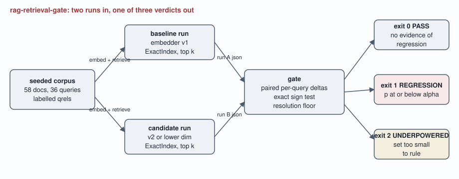

# rag-retrieval-gate

**A retrieval regression gate for RAG systems that attributes failures to the
retriever, prices what its golden set can and cannot detect, and returns
"this set is too small to know" as its own exit code.**

[](https://github.com/lavanyag-wq/rag-retrieval-gate/actions/workflows/ci.yml)

Two numbers RAG teams rely on are structurally mute. An end-to-end answer
score aggregates the retriever and the generator, so it cannot attribute a
failure to either one, no matter how carefully it is read. And a pass/fail
threshold on a small golden set cannot separate a real regression from
sampling noise, because the set's size puts a hard floor under the smallest
effect it can resolve. This tool supplies what those artefacts cannot: paired
per-query comparison against labelled relevance, an exact significance test
with its power arithmetic published, and a third verdict, UNDERPOWERED, for
the case where no honest verdict exists.

## The numbers to read first

- **This gate cannot call a regression on fewer than 5 one-direction flips.**
  At alpha 0.05 that is the exact sign test's floor, and on this repository's
  own 36-query golden set it means 13.9% of the 36-query set must move before
  any verdict is possible. Detecting a regression that hits 10% of queries
  with 80% power needs 66 queries; a 5% regression would take 134 queries to
  detect. Most hand-curated golden sets are smaller than that.
- **The rule this replaces is mostly noise.** A one-point mean-recall
  threshold, compared across resampled golden subsets of an identical system,
  fired on 84.5% of trials at subset size 8 and fires 100% of the time at
  size 18. Every one of those is a false positive. The gate under its own
  null fired 2.5% of the time over 2000 sign-flip trials, against a nominal 5%.
- **A realistic "upgrade" produced losses this set cannot confirm.** Switching
  embedder v1 to v2 moved mean recall by 4.2 points, with 4 queries lost and
  1 improved, p = 0.1875: no verdict, and all 4 of them acronym-style. The
  mean understates a concentrated loss; an end-to-end score would bury it.

Credibility line: 136 tests, 98% line coverage, and every figure in this
document is re-measured by CI and matched against the prose by
`tools/check_numbers.py`. Break one number and the build fails.

## Quickstart

Prerequisites: Python `3.10` or newer, numpy. Nothing else, no network, no keys.

```bash
pip install -e ".[dev]"
rag-gate generate --seed 7 --out /tmp/corpus.json
rag-gate run --corpus /tmp/corpus.json --embedder v1 --out /tmp/base.json
rag-gate run --corpus /tmp/corpus.json --embedder v2 --out /tmp/cand.json
rag-gate gate --baseline /tmp/base.json --candidate /tmp/cand.json ; echo "exit $?"
make verify   # lint, 136 tests, experiments re-run, every published number re-checked
```

The `gate` command prints the headline comparison, the per-style transition
table and the resolution sentence, then exits 0, 1 or 2 (see exit codes below).

## What the gate concludes about three realistic changes

One baseline (v1, dim=256), three candidates, same 36-query corpus. From
`experiments/exp_regression.py`:

| candidate | change | mean recall delta | worse | better | p | verdict |
| --- | --- | ---: | ---: | ---: | ---: | --- |
| upgrade | v2 embedder | -4.2 pts | 4 | 1 | 0.1875 | PASS |
| downsize | dim 256 to 64 | -6.9 pts | 5 | 0 | 0.03125 | REGRESSION |
| collapse | dim 256 to 32 | -20.8 pts | 15 | 1 | 0.00026 | REGRESSION |

The upgrade row is the uncomfortable one. Dim=64 moved the mean by 6.9 points
and gates cleanly: all 5 moved queries worse, p = 0.03125 on the exact sign
test. The upgrade's 4.2 point mean delta looks almost as bad, and the set
cannot confirm it; what it can say is where the losses sit, because the run
format keeps ranked lists: every lost document is attributable, and the
transition table shows the damage concentrated in one query style. The honest
action is growing the set, and the resolution command says by how much.

## What a golden set of your size can detect

From `experiments/exp_resolution.py`, exact binomial arithmetic, no simulation:

| set size | minimum one-direction flips | share of set |
| ---: | ---: | ---: |
| 10 | 5 | 50.0% |
| 20 | 5 | 25.0% |
| 36 | 5 | 13.9% |
| 100 | 5 | 5.0% |
| 200 | 5 | 2.5% |

| regression hits | queries needed (power 0.8) |
| ---: | ---: |
| 50% of queries | 12 |
| 25% | 26 |
| 10% | 66 |
| 5% | 134 |

Run it for your own set: `rag-gate resolution --queries 36 --target-rate 0.1`.

## The rule this replaces, measured

`experiments/exp_noise_floor.py` compares an identical system to itself across
resampled golden subsets. The common "fail if mean recall drops a point" rule
fired on 84.5% of 2000 trials at subset size 8, and fires 100% of the time at
size 18. The size-18 result is worth understanding rather than laughing at:
recall on this corpus is quantized to halves, so subset means move in steps
larger than one point, and the threshold sits below the metric's own
quantization. The gate, measured against its sign-flip null on the same
machinery, fired 2.5% of the time (nominal alpha 5%; the exact test is
conservative at 5 moved queries, where the only significant outcome has
probability 0.03125).

## The bug the measurement found

The first version of the noise-floor experiment read 78.5% false positives
for the gate itself at subset size 18. That number is impossible for a
calibrated test under its own null, so it was diagnosing the experiment: an
unpaired construction (two disjoint subsets scored against their pooled
median) had been fed to a paired test. The null is now sampled by
sign-flipping the real paired deltas, the measured rate is 2.5%, and the
broken reading is pinned in the receipts so the story cannot drift. The full
writeup is [ADR-004](docs/adr/ADR-004-sign-test-null.md), and the fix is its
own commit in the history.

## Architecture



Generated by `tools/render_diagram.py`, committed so it renders identically
on GitHub and offline.

## Evidence

Real output of the demo script (captured verbatim; reproduce with the
commands in the quickstart):

```text
$ rag-gate gate --baseline /tmp/base.json --candidate /tmp/cand.json
verdict: PASS
metric recall@5: mean 0.819 -> 0.778 (delta -0.042)
per-query: 4 worse, 1 better, 31 unchanged
sign test p=0.1875 at alpha=0.05
resolution: this set cannot call a regression on fewer than 5 one-direction flips
  style acronym: 4 worse, 1 better
$ echo "exit $?"
exit 0
```

## The corpus, and the awkward cases in it

58 documents and 36 queries, generated from a seed, labelled at generation
time. The deliberately hard content: distractors that share surface
vocabulary with their topic (a churn-model topic shadowed by butter-churn
documents, a Spark topic shadowed by spark plugs), paraphrase documents that
drop half the exact keywords and are still labelled relevant, and
acronym-only queries ("FSI status") whose only lexical bridge is a
parenthetical in the paraphrase. The acronym style is where the v1 to v2
change concentrates its damage, which is why the transition table groups by
style. A corpus of easy cases would measure nothing.

## What this repository cannot establish

- **Absolute retrieval quality.** The embedders are deterministic hashing
  functions (ADR-001): the mean recall levels here are properties of a
  synthetic corpus and are never quoted as findings. Every claim about the
  gate (calibration, resolution, attribution, the naive rule's noise) is a
  property of the comparison machinery and survives the substitution; a claim
  about any real embedder pair needs a real labelled set through the same
  pipeline.
- **Regressions below the floor.** By construction. The gate reports the
  floor instead of ruling under it.
- **Generator failures.** Out of scope on purpose: this tool isolates the
  retriever precisely because end-to-end scores cannot. The trigger for
  adding an answer-side gate is having labelled answer judgments, which are a
  different and more expensive artefact than relevance labels.
- **Magnitude information.** The sign test uses direction only; ADR-002
  prices that choice.
- One figure in this document is recorded history rather than a current
  measurement: the pre-fix experiment read 78.5% false positives, and the
  receipts pin it as such.

## Layout, exit codes, reproduction

```
src/rag_retrieval_gate/   corpus, embedder, index, metrics, stats, gate, cli
  chroma_store.py         optional adapter, validates before importing chromadb
tests/                    136 property-named tests
experiments/              the three experiments behind every table above
tools/                    collect_metrics, check_numbers, render_diagram
docs/adr/                 five decision records
docs/experiments/         JSON the experiments wrote; CI regenerates and diffs
```

Exit codes of `rag-gate gate`: **0** PASS (no evidence of regression at this
resolution), **1** REGRESSION (the tool did its job and the answer is no),
**2** UNDERPOWERED (queries moved, but fewer than the floor: the set cannot
support any verdict, and treating this as a pass is the failure mode this
tool exists to remove), **3** error (the tool failed to answer; never confuse
it with 1). ADR-005 is the reasoning.

Make targets: `lint`, `test`, `experiments`, `receipts`, and `verify`, which
runs all of them from a fresh clone with no network. The number checker
matches anchor phrases rather than bare digits, because a digit match passes
while the sentence around it goes stale.

## Tech stack

| technology | role here | why this one |
| --- | --- | --- |
| numpy | vectors and the exact index | the only runtime dependency; exact cosine over 58 documents needs nothing more |
| blake2b (stdlib) | token hashing | stable across processes and platforms, unlike Python's salted hash() |
| exact binomial summation (stdlib math) | significance and power | closed-form, seedless, verifiable by hand; ADR-002 |
| pytest + coverage | 136 tests, 98% line coverage | test names state properties; coverage is measured, not asserted |
| ruff | lint in CI | one tool, one config, line length actually held |
| chromadb (optional extra) | real-store adapter | proves the index protocol against a store teams actually run, without costing the default path its determinism |

ADRs: [deterministic embedders](docs/adr/ADR-001-deterministic-embedders.md),
[exact sign test](docs/adr/ADR-002-exact-sign-test.md),
[exact index default](docs/adr/ADR-003-exact-index-default.md),
[the experiment's null](docs/adr/ADR-004-sign-test-null.md),
[exit code semantics](docs/adr/ADR-005-exit-codes.md).

## The pivot, and future work

Intentionally out of scope: gating the generator. The trigger for building it
is owning labelled answer judgments, at which point the same paired machinery
applies to answer scores with the retriever held fixed.

Future work: graded relevance in the generator and nDCG that earns its place;
a Wilcoxon option beside the sign test with a seeded, documented power
simulation; ingestion docs for real run files (the format already supports
them); and a trend mode that tracks UNDERPOWERED verdicts over time, because
their frequency is the argument for growing a golden set. First metric to
watch there: share of gate invocations exiting 2.
